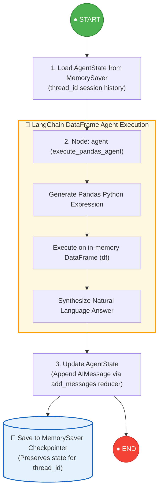

# 🎓 Student Data AI Agent

> **An intelligent conversational data analyst for student datasets — powered by LangChain Pandas DataFrame Agent and orchestrated with LangGraph for persistent multi-turn chat memory.**

[](https://www.python.org/)
[](https://langchain-ai.github.io/langgraph/)
[](https://python.langchain.com/docs/integrations/toolkits/pandas/)
[-orange.svg)](https://mistral.ai/)
[](https://streamlit.io/)
[](https://chatgpt.com/share/6a899e16-f248-83e9-95bb-ec6c6e2238e5)
[](LICENSE)

---

## 🌟 Overview

The **Student Data AI Agent** enables educators, administrators, and researchers to explore and query tabular student datasets (`.csv`) using natural language. Instead of writing complex SQL queries or Pandas code manually, users can simply ask questions in plain English.

The system combines two modern AI engineering paradigms:
1. **LangChain Pandas DataFrame Agent**: Converts natural language into valid Pandas Python expressions executed directly on the in-memory dataset with full analytical accuracy.
2. **LangGraph State & Memory Persistence**: Orchestrates the agent inside a stateful graph using `MemorySaver`, maintaining conversation context across multi-turn follow-up questions.
3. **Single Source of Truth Frontend**: The Streamlit interface renders chat history directly from LangGraph's state snapshot (`graph.get_state()`), eliminating redundant state management.

---

## 🧪 Tested & Verified

This architecture and agent prompt workflow have been verified and tested:  
👉 **[View Test & Validation Transcript on ChatGPT](https://chatgpt.com/share/6a899e16-f248-83e9-95bb-ec6c6e2238e5)**

---

## ✨ Key Features

- 💬 **Natural Language Data Querying**: Ask questions in plain English; the agent generates and executes accurate Pandas expressions.
- 🧠 **Persistent Multi-Turn Context**: Remembers prior questions and calculations within a session (e.g. *"Show students with GPA > 3.8"*, then *"What is their average attendance?"*).
- 🖥️ **Interactive Streamlit Web UI**: Simple CSV drag-and-drop upload with live row/column metrics and chat bubbles.
- 🎯 **Direct State Synchronization**: Frontend chat history is read directly from LangGraph state snapshots (`graph.get_state()`).
- ⚡ **Mistral AI Integration**: Powered by `mistral-small-latest` with `temperature=0` for deterministic, hallucination-free code execution.
- 🧩 **Decoupled Modular Architecture**: Clean single-responsibility separation across state, agent creation, node execution, graph assembly, and runners.
- 🪵 **Centralized Logging**: Simultaneous live console logging and persistent file logging in `logs/app.log`.

---

## 🔄 LangGraph StateGraph Architecture



---

## 📁 Project Directory Structure

```text
StudentData-AI-Agent/
│
├── app.py                    # 🖥️ Streamlit Web Application (Frontend)
├── requirements.txt          # 📦 Python Dependencies
├── .env.example              # ⚙️ Environment Variables Template
├── README.md                 # 📖 Project Documentation
│
├── config/
│   └── settings.py           # ⚙️ Typed Configuration Loader (.env)
│
├── data/
│   └── .gitkeep              # 📊 Dataset Directory Placeholder
│
├── logs/
│   └── .gitkeep              # 📝 Application Log Storage (logs/app.log)
│
├── src/
│   ├── __init__.py
│   ├── data_loader.py        # 📥 CSV Ingestion & Validation (load_csv)
│   ├── llm.py                # 🧠 Mistral LLM Client Factory (get_llm)
│   │
│   ├── agent/                # 🤖 Decoupled LangGraph Agent Modules
│   │   ├── __init__.py
│   │   ├── state.py          # 1. State Definition (AgentState with add_messages)
│   │   ├── pandas_agent.py   # 2. LangChain Pandas DataFrame Agent Factory
│   │   ├── nodes.py          # 3. LangGraph Node Execution Logic
│   │   ├── graph.py          # 4. StateGraph Assembly & MemorySaver
│   │   └── runner.py         # 5. Graph Invocation & State Retrieval
│   │
│   └── utils/
│       └── logger.py         # 🪵 Centralized Logging (Console + logs/app.log)
│
└── tests/
    └── test_agent.py         # 🧪 Standalone CLI Test Runner
```

---

## 🛠️ Tech Stack

| Component | Technology | Description |
| :--- | :--- | :--- |
| **Language** | Python 3.10+ | Core programming runtime |
| **Agent Framework** | LangChain Experimental | `create_pandas_dataframe_agent` with native tool-calling |
| **State Orchestration** | LangGraph | `StateGraph` with `MemorySaver` checkpointer for conversation memory |
| **LLM Provider** | Mistral AI | `mistral-small-latest` via `ChatMistralAI` |
| **Data Engine** | Pandas | High-performance tabular data manipulation |
| **User Interface** | Streamlit | Web application with live chat interface |
| **Configuration** | Python-Dotenv | Secure environment variables management |

---

## 🚀 Quick Start Guide

### 1. Clone the Repository
```bash
git clone https://github.com/niravrupapara/StudentData-AI-Agent.git
cd StudentData-AI-Agent
```

### 2. Set Up Virtual Environment
```powershell
# On Windows PowerShell
python -m venv venv
.\venv\Scripts\Activate.ps1

# On Linux / macOS
python3 -m venv venv
source venv/bin/activate
```

### 3. Install Dependencies
```bash
pip install -r requirements.txt
```

### 4. Configure Environment Variables
Create a `.env` file in the project root directory:
```ini
# Mistral AI API Key (Required)
MISTRAL_API_KEY=your_mistral_api_key_here

# LLM Model Name (Optional, defaults to mistral-small-latest)
LLM_MODEL=mistral-small-latest

# Logging Level (Optional: DEBUG, INFO, WARNING, ERROR)
LOG_LEVEL=INFO
```

---

## 💻 Running the Application

### 🖥️ Option 1: Streamlit Web UI (Recommended)
```bash
streamlit run app.py
```
Open your browser and navigate to `http://localhost:8501`. Upload any student CSV dataset from the sidebar to start chatting!

### 🧪 Option 2: CLI Test Runner
```bash
python -m tests.test_agent
```

---

## 💡 Example Queries

| Category | Example Question |
| :--- | :--- |
| **📊 Aggregation & Stats** | *"How many total students are in the dataset?"*<br/>*"What is the average GPA across all branches?"*<br/>*"Show the count of students per branch."* |
| **🔍 Filtering & Ranking** | *"List the top 5 students in Computer Science by score."*<br/>*"Find students with attendance lower than 75%."*<br/>*"Who is the highest scoring female student in Electrical?"* |
| **💬 Multi-Turn Follow-Ups** | **User**: *"How many students are in Mechanical?"*<br/>**AI**: *"There are 42 students in Mechanical."*<br/>**User**: *"What is their average score?"*<br/>**AI**: *"The average score of students in Mechanical is 78.4."* |

---

## 🪵 Logging & Diagnostics

Application logs are written simultaneously to:
- **Console (stdout)**: Colored, formatted real-time logs.
- **Log File**: Persistent logging saved at `logs/app.log`.

---

## 📄 License

This project is licensed under the **MIT License** - see the [LICENSE](LICENSE) file for details.
