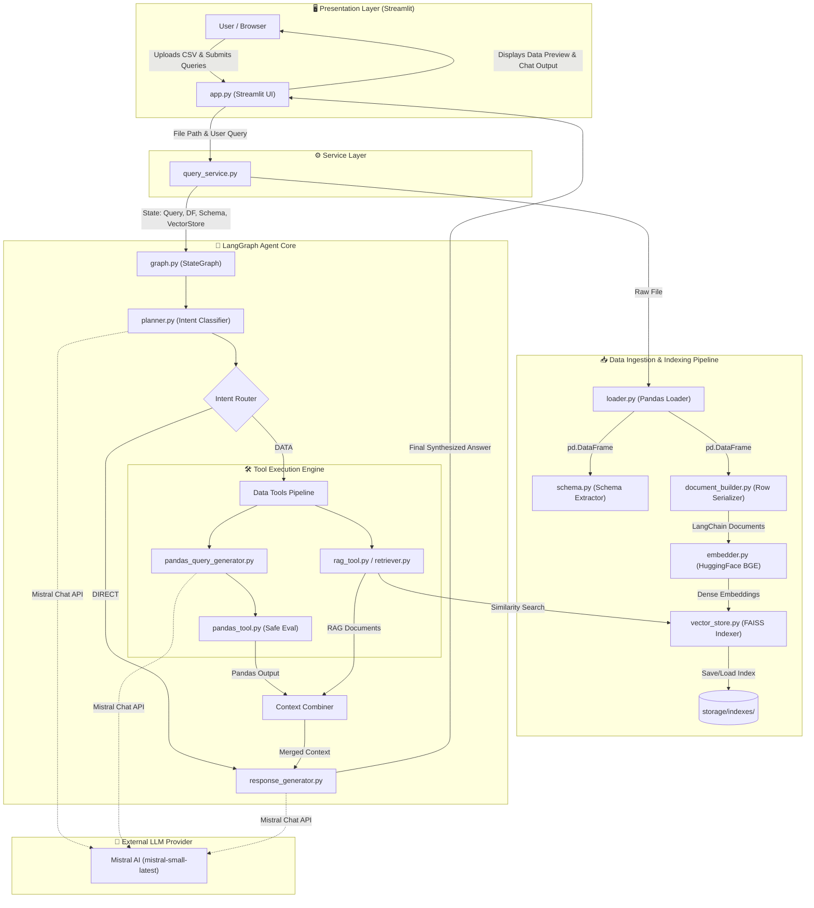
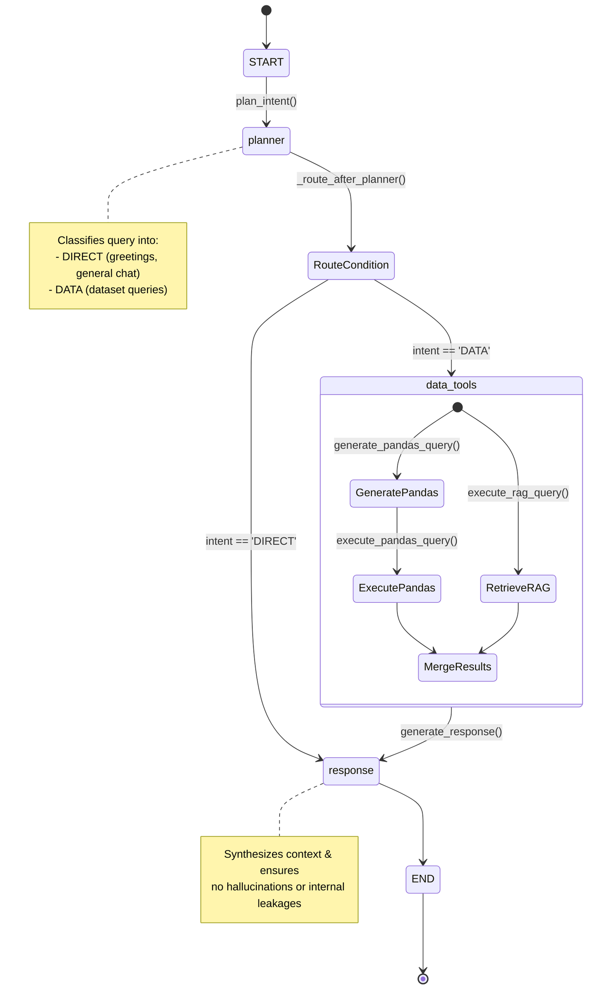
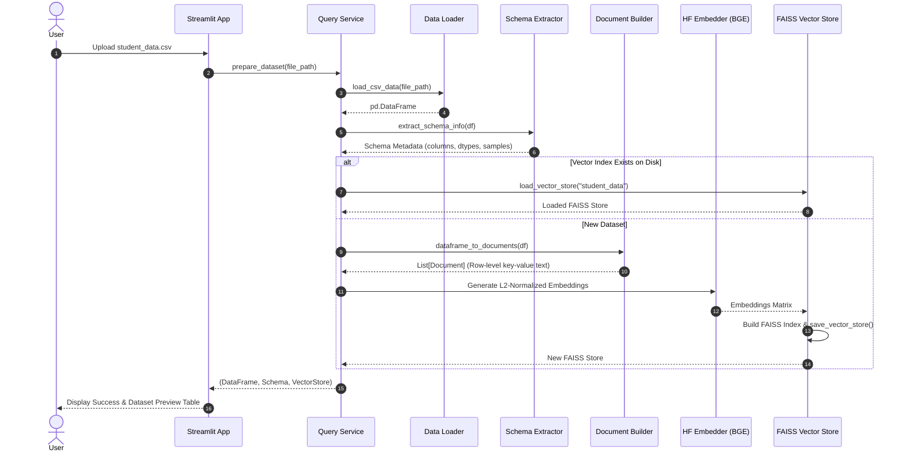

# 🎓 Student Data AI Agent

[](https://www.python.org/)
[](https://langchain-ai.github.io/langgraph/)
[](https://mistral.ai/)
[](https://github.com/facebookresearch/faiss)
[](https://streamlit.io/)
[](LICENSE)

An intelligent, multi-strategy conversational AI agent designed to analyze, query, and extract insights from tabular student datasets (CSV). Powered by **LangGraph**, **Mistral AI**, **FAISS vector search**, and **Pandas**, this agent intelligently combines deterministic code execution with semantic vector retrieval to provide precise, hallucination-free answers.

---

## 📑 Table of Contents

- [Overview](#-overview)
- [Key Features](#-key-features)
- [System Architecture](#-system-architecture)
- [Agent Workflow & Decision Graph](#-agent-workflow--decision-graph)
- [Data Ingestion & RAG Pipeline](#-data-ingestion--rag-pipeline)
- [Project Directory Structure](#-project-directory-structure)
- [Tech Stack](#-tech-stack)
- [Prerequisites & Requirements](#-prerequisites--requirements)
- [Installation & Setup](#-installation--setup)
- [Environment Configuration](#-environment-configuration)
- [Running the Application](#-running-the-application)
- [Usage & Sample Queries](#-usage--sample-queries)
- [Logging & Error Handling](#-logging--error-handling)
- [License](#-license)

---

## 🌟 Overview

Analyzing tabular educational datasets often requires both exact numerical calculations (e.g., averages, counts, unique values) and contextual semantic queries (e.g., student remarks, profile lookups, subject faculties). 

Standard LLM solutions either hallucinate on numbers or fail to understand messy text data. The **Student Data AI Agent** solves this through a **Hybrid Dual-Engine Architecture**:
1. **Deterministic Computation Engine**: Uses LLM-generated Pandas expressions executed inside a secured environment for exact filtering, counts, and aggregations.
2. **Semantic Retrieval Engine (RAG)**: Converts tabular rows into structured documents indexed in a high-speed **FAISS vector store** using dense sentence embeddings (`BAAI/bge-small-en-v1.5`).
3. **Adaptive Agentic Graph**: A **LangGraph** state machine dynamically classifies user intent and routes queries to the appropriate engine or standard conversational response.

---

## ✨ Key Features

- 🔄 **Intelligent Intent Planning**: Dynamically routes inputs into direct conversational chat (`DIRECT`) vs. dataset operations (`DATA`).
- ⚡ **Dual-Engine Fusion (Pandas + RAG)**: Merges exact tabular querying with semantic vector similarity search for maximum accuracy.
- 🛡️ **Sandboxed Pandas Execution**: Generates and executes validated Pandas expressions within a restricted namespace.
- 🔍 **In-Memory & Persistent Vector Store**: Automatically builds and caches FAISS vector indexes on disk for fast retrieval.
- 📊 **Interactive Web UI**: Streamlit interface with drag-and-drop CSV upload, interactive dataset viewer, and smooth chat experience.
- 📝 **Comprehensive Dual Logging**: Tracks agent decisions, graph states, and tool execution in both the console and rotating `logs/app.log`.
- ⚙️ **Configurable & Extensible**: Fully customizable via `.env` for models, top-k retrieval parameters, and log levels.

---

## 🏗️ System Architecture

The following diagram illustrates the complete end-to-end architecture from user interaction to data ingestion, vector indexing, agentic graph execution, and final response synthesis.



---

## 🔄 Agent Workflow & Decision Graph

The agent's decision logic is governed by a **LangGraph StateGraph** operating on a shared `AgentState`.



### Agent State Definition (`AgentState`)

```python
class AgentState(TypedDict, total=False):
    user_query: str             # Original natural-language user question
    intent: str                 # 'DIRECT' or 'DATA'
    dataframe: Any              # Active Pandas DataFrame
    schema: dict[str, Any]      # Extracted column names, types, sample rows
    vector_store: Any           # Initialized FAISS vector store
    pandas_result: Any          # Result from executed Pandas query
    rag_result: list[Any]       # Retrieved LangChain Documents
    context: str                # Combined context string
    final_answer: str           # User-facing synthesized answer
    error: str                  # Diagnostic error messages if any
```

---

## 📊 Data Ingestion & RAG Pipeline



---

## 📁 Project Directory Structure

```text
StudentData-AI-Agent/
│
├── .env                              # Environment variables (API Keys, Model names)
├── .gitignore                        # Git ignore patterns
├── LICENSE                           # Project License (MIT)
├── README.md                         # Project documentation & architectural guide
├── app.py                            # Streamlit web application entry point
├── create_structure.py               # Repository scaffolding automation script
├── requirements.txt                  # Python package dependencies
│
├── config/
│   ├── __init__.py
│   └── settings.py                   # Centralized configuration & environment loader
│
├── data/
│   ├── processed/                    # Intermediate processed data storage
│   └── uploads/                      # Uploaded CSV dataset storage
│
├── logs/
│   └── app.log                       # Application logs (rotating, UTF-8 encoded)
│
├── storage/
│   └── indexes/                      # Persistent FAISS vector indexes & metadata
│       └── student_data/
│           ├── index.faiss           # FAISS index binary
│           └── index.pkl             # Document metadata pickle
│
└── src/
    ├── __init__.py
    │
    ├── agent/                        # LangGraph orchestration and logic
    │   ├── __init__.py
    │   ├── graph.py                  # StateGraph definition and compilation
    │   ├── state.py                  # AgentState TypedDict schema
    │   ├── planner.py                # LLM intent classification node (DIRECT vs DATA)
    │   ├── pandas_query_generator.py # Natural language to Pandas expression generator
    │   └── response_generator.py     # Final grounded answer synthesis node
    │
    ├── data/                         # Data ingestion and schema extraction
    │   ├── __init__.py
    │   ├── loader.py                 # CSV loading with validation
    │   └── schema.py                 # Dataset schema and sample extraction
    │
    ├── llm/                          # LLM clients and system prompts
    │   ├── __init__.py
    │   ├── client.py                 # Mistral AI Chat Client factory
    │   └── prompts.py                # System prompts for planner and response generator
    │
    ├── rag/                          # Vector retrieval & document processing
    │   ├── __init__.py
    │   ├── document_builder.py       # Converts DataFrame rows to LangChain Documents
    │   ├── embedder.py               # HuggingFace sentence embeddings wrapper
    │   ├── retriever.py              # Similarity search execution
    │   └── vector_store.py           # FAISS store creation, saving, and loading
    │
    ├── services/                     # Business logic and facade services
    │   ├── __init__.py
    │   └── query_service.py          # High-level dataset prep and query execution
    │
    ├── tools/                        # Agent tool execution engines
    │   ├── __init__.py
    │   ├── pandas_tool.py            # Restricted eval of Pandas expressions
    │   └── rag_tool.py               # Vector similarity search tool wrapper
    │
    └── utils/                        # Shared utility modules
        ├── __init__.py
        ├── logger.py                 # Dual console + file logger setup
        └── exceptions.py             # Custom application exceptions
```

---

## 🛠️ Tech Stack

| Component | Technology | Purpose |
| :--- | :--- | :--- |
| **Agent Orchestration** | [LangGraph](https://langchain-ai.github.io/langgraph/) | State machine, conditional routing, and multi-node agent workflow |
| **LLM Provider** | [Mistral AI](https://mistral.ai/) (`mistral-small-latest`) | Intent classification, Pandas query generation, and response synthesis |
| **Framework Ecosystem** | [LangChain](https://www.langchain.com/) | LLM integration, prompt templates, and Document abstractions |
| **Embeddings** | [HuggingFace](https://huggingface.co/) (`BAAI/bge-small-en-v1.5`) | Dense text embeddings with L2 normalization (CPU-optimized) |
| **Vector Database** | [FAISS (Facebook AI Similarity Search)](https://github.com/facebookresearch/faiss) | Ultra-fast similarity search over tabular student documents |
| **Tabular Engine** | [Pandas](https://pandas.pydata.org/) | Data loading, schema introspection, and deterministic data queries |
| **Web Interface** | [Streamlit](https://streamlit.io/) | Interactive web UI for file upload, dataset viewer, and chat |
| **Configuration** | [python-dotenv](https://pypi.org/project/python-dotenv/) | Environment variable management |

---

## 📋 Prerequisites & Requirements

- **Python**: Version `3.10` or higher (tested on `3.10`, `3.11`, `3.12`, `3.13`)
- **Mistral AI API Key**: Obtain a free/paid API key from [Mistral AI Console](https://console.mistral.ai/)
- **Operating System**: Windows, macOS, or Linux

---

## 🚀 Installation & Setup

### 1. Clone the Repository

```bash
git clone https://github.com/your-username/StudentData-AI-Agent.git
cd StudentData-AI-Agent
```

### 2. Create and Activate a Virtual Environment

**On Windows (PowerShell):**
```powershell
python -m venv venv
.\venv\Scripts\Activate.ps1
```

**On Linux / macOS:**
```bash
python3 -m venv venv
source venv/bin/activate
```

### 3. Install Dependencies

```bash
pip install --upgrade pip
pip install -r requirements.txt
```

---

## ⚙️ Environment Configuration

Create a `.env` file in the root directory of the project (or edit the existing one) with the following parameters:

```env
# Required: Your Mistral API Key
MISTRAL_API_KEY=your_mistral_api_key_here

# Optional: LLM Model Selection (Default: mistral-small-latest)
LLM_MODEL=mistral-small-latest

# Optional: Embedding Model (Default: BAAI/bge-small-en-v1.5)
EMBEDDING_MODEL=BAAI/bge-small-en-v1.5

# Optional: Number of RAG Documents to Retrieve (Default: 5)
TOP_K=5

# Optional: Logging Level (DEBUG, INFO, WARNING, ERROR)
LOG_LEVEL=INFO
```

---

## 🖥️ Running the Application

Launch the Streamlit web application:

```bash
streamlit run app.py
```

Once running, the application will automatically open in your default browser at:
```
http://localhost:8501
```

---

## 💡 Usage & Sample Queries

### 1. Uploading Data
1. In the left sidebar, click **"Upload CSV file"**.
2. Select any student-related CSV dataset (e.g., columns such as `StudentID`, `Name`, `Department`, `Subject`, `Faculty`, `Marks`, `CGPA`, `Attendance`, `Remarks`).
3. The dataset will be parsed, its schema analyzed, and a FAISS index automatically built.
4. Expand the **"View Dataset"** section to inspect the data.

### 2. Example Query Scenarios

| Category | Example Question | Processing Strategy |
| :--- | :--- | :--- |
| **Greetings / General** | *"Hello! What can you help me with?"* | Classified as `DIRECT` &rarr; Responded without dataset execution. |
| **Faculty & Course Lookups** | *"Who teaches Machine Learning?"* | Classified as `DATA` &rarr; Generates `df[df['Subject']=='Machine Learning']['Faculty'].unique()` + RAG Context. |
| **Filtering & Aggregations** | *"How many students have a CGPA higher than 8.5?"* | Classified as `DATA` &rarr; Generates `df[df['CGPA'] > 8.5].shape[0]`. |
| **Listings & Extremes** | *"Which student scored the highest marks in Mathematics?"* | Classified as `DATA` &rarr; Filters maximum score and retrieves student profile details. |
| **Semantic / Profile Lookups** | *"Tell me about student Nirav Rupapara and his academic status."* | Classified as `DATA` &rarr; RAG similarity search retrieves row document context. |

---

## 🛡️ Logging & Error Handling

- **Dual Logging**: All operations are streamed live to standard output and written to `logs/app.log`.
- **Sandboxed Execution**: Pandas queries are evaluated using a restricted global dictionary (`{"__builtins__": {}}`) to prevent arbitrary code execution.
- **Graceful Fallbacks**: If the LLM generates an unexpected planner tag, the system falls back to `DATA` mode to prevent query drops.
- **User-Friendly Error Banners**: Runtime errors are caught and surfaced clearly in the Streamlit UI with detailed traces preserved in the log file.

---

## 📜 License

This project is licensed under the **MIT License**. See the [LICENSE](LICENSE) file for details.