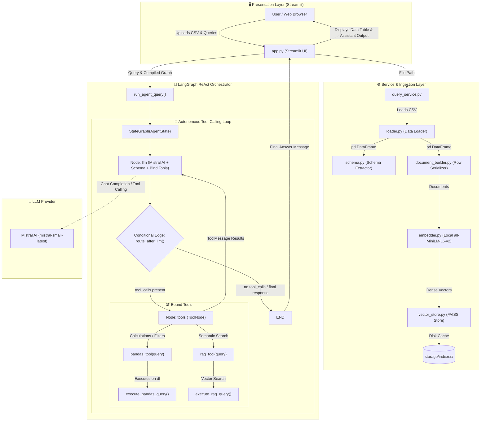
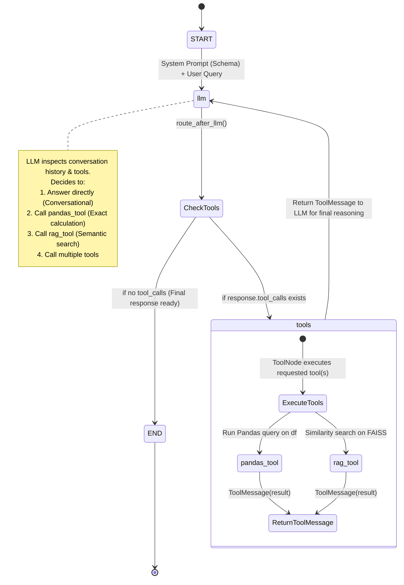
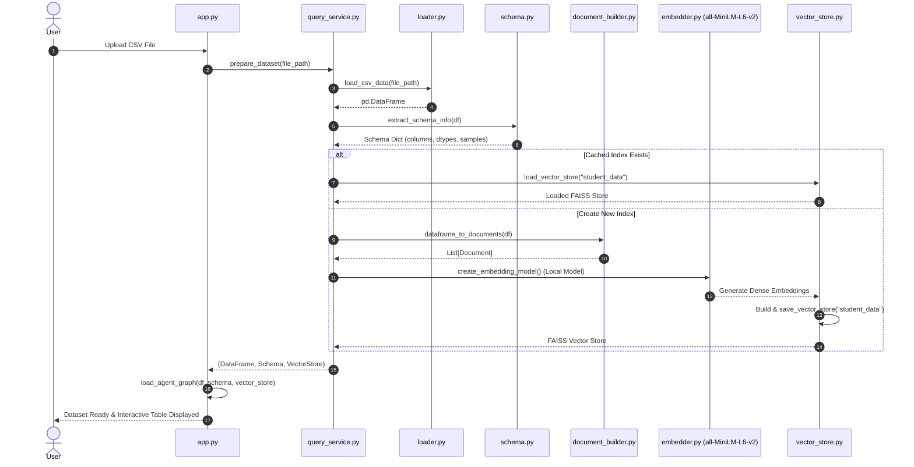

# 🎓 Student Data AI Agent

[](https://www.python.org/)
[](https://langchain-ai.github.io/langgraph/)
[](https://langchain-ai.github.io/langgraph/how-tos/tool-calling/)
[](https://mistral.ai/)
[](https://github.com/facebookresearch/faiss)
[-yellow.svg)](https://huggingface.co/sentence-transformers/all-MiniLM-L6-v2)
[](https://streamlit.io/)
[](LICENSE)

An intelligent, autonomous conversational AI agent designed to analyze, query, and extract insights from tabular student datasets (CSV). Built on **LangGraph's dynamic ReAct Tool-Calling architecture**, the agent autonomously decides between direct responses, **sandboxed Pandas code execution**, and **semantic vector retrieval (RAG via FAISS & local Sentence Transformers)**.

---

## 📑 Table of Contents

- [Overview](#-overview)
- [Key Features](#-key-features)
- [System Architecture](#-system-architecture)
- [LangGraph ReAct Node Architecture](#-langgraph-react-node-architecture)
- [Tool-Calling Mechanism & Tools](#-tool-calling-mechanism--tools)
- [Data Ingestion & Local Embedding Pipeline](#-data-ingestion--local-embedding-pipeline)
- [Project Directory Structure](#-project-directory-structure)
- [Tech Stack](#-tech-stack)
- [Prerequisites & Requirements](#-prerequisites--requirements)
- [Installation & Setup](#-installation--setup)
- [Environment Configuration](#-environment-configuration)
- [Downloading the Local Embedding Model](#-downloading-the-local-embedding-model)
- [Running the Application](#-running-the-application)
- [Usage & Sample Queries](#-usage--sample-queries)
- [Logging & Error Handling](#-logging--error-handling)
- [License](#-license)

---

## 🌟 Overview

Tabular educational datasets require both **deterministic mathematical computation** (e.g., exact averages, counts, unique values, top scores) and **semantic textual understanding** (e.g., contextual remarks, student history, faculty details).

The **Student Data AI Agent** uses an autonomous **ReAct (Reasoning + Acting) Tool-Calling loop**:
1. **Dynamic Tool Calling**: Powered by LangGraph and Mistral AI, the agent inspects the user question along with the injected dataset schema and autonomously decides which tool to call or whether to answer directly.
2. **Deterministic Computation Engine (`pandas_tool`)**: Converts analytical questions into valid Pandas expressions executed inside a sandboxed Python namespace.
3. **Semantic Retrieval Engine (`rag_tool`)**: Searches row-level serialized student documents using dense embeddings (`all-MiniLM-L6-v2`) and a high-performance **FAISS vector store**.
4. **Offline Embedding Support**: Embeddings run completely locally using pre-downloaded HuggingFace models for fast, zero-latency similarity queries.

---

## ✨ Key Features

- 🧠 **Autonomous ReAct Agent Loop**: Iterative LLM reasoning cycle that dynamically selects, invokes, and inspects tool outputs.
- 🛠️ **Native LangChain `@tool` Integration**: Dedicated `pandas_tool` and `rag_tool` bound dynamically to the loaded dataset and vector store.
- 📐 **Schema-Injected System Prompting**: Dataset metadata, column data types, and sample rows are injected into the prompt with strict column-matching instructions to prevent hallucinations.
- 🔒 **Sandboxed Execution**: Pandas operations are safely evaluated against a restricted global namespace (`{"__builtins__": {}}`).
- ⚡ **Local Offline Embeddings**: Ships with `download_model.py` to store `all-MiniLM-L6-v2` locally in `./models/`, eliminating network dependencies during runtime.
- 💾 **Persistent FAISS Vector Storage**: Indexes are cached on disk (`storage/indexes/`) to allow immediate re-use without re-indexing.
- 🖥️ **Interactive Streamlit Web UI**: Simple drag-and-drop CSV upload, interactive data table preview, and conversational chat interface.
- 📝 **Dual-Target Logging**: Live stdout and persistent formatted logging in `logs/app.log`.

---

## 🏗️ System Architecture

The following diagram illustrates the complete end-to-end component flow:



---

## 🔄 LangGraph ReAct Node Architecture

The agent's decision logic is governed by a compiled **LangGraph StateGraph** utilizing native message state reduction:



### Agent State Schema (`AgentState`)

```python
from typing import Annotated, Any, TypedDict
from langchain_core.messages import AnyMessage
from langgraph.graph.message import add_messages

class AgentState(TypedDict, total=False):
    # Conversation message history with LangGraph message reducer
    messages: Annotated[list[AnyMessage], add_messages]

    # Original user question
    user_query: str

    # Active student DataFrame
    dataframe: Any

    # Dataset schema information (columns, dtypes, samples)
    schema: dict[str, Any]

    # FAISS vector store instance
    vector_store: Any
```

---

## 🛠️ Tool-Calling Mechanism & Tools

### 1. `pandas_tool`
- **Purpose**: Handles structured calculations, aggregations, filtering, counts, sorting, and min/max operations.
- **Factory Function**: `create_pandas_tool(dataframe)`
- **Safety**: Executes inside `execute_pandas_query()` with restricted global builtins (`{"__builtins__": {}}`) and explicit local references to `df` and `pd`.
- **Prompt Guidance**: Explicitly forbids hallucinating column names (e.g. requires using `department` if `branch` is not in the schema).

### 2. `rag_tool`
- **Purpose**: Handles contextual, descriptive, or fuzzy queries (e.g., student remarks, historical performance, descriptive faculty information).
- **Factory Function**: `create_rag_tool(vector_store)`
- **Execution**: Runs vector similarity search via `retrieve_documents()` with configurable `TOP_K`.

---

## 📥 Data Ingestion & Local Embedding Pipeline



---

## 📁 Project Directory Structure

```text
StudentData-AI-Agent/
│
├── .env                              # Environment variables (API Keys, Model settings)
├── .env.example                      # Environment variables template
├── .gitignore                        # Git exclusion rules (storage, uploads, models)
├── LICENSE                           # MIT License
├── README.md                         # Project documentation & architectural guide
├── app.py                            # Streamlit web application entry point
├── create_structure.py               # Project scaffolding utility
├── download_model.py                 # Offline HuggingFace embedding model downloader
├── requirements.txt                  # Python dependencies
│
├── config/
│   ├── __init__.py
│   └── settings.py                   # Global configuration & environment loader
│
├── data/
│   ├── processed/                    # Processed CSV datasets (.gitkeep)
│   └── uploads/                      # Uploaded CSV datasets (.gitkeep)
│
├── logs/
│   └── app.log                       # Application logs (console + file handler)
│
├── models/                           # Local offline sentence transformer storage
│   └── all-MiniLM-L6-v2/             # Downloaded embedding model weights & tokenizer
│
├── storage/
│   └── indexes/                      # Persistent FAISS vector indexes (.gitkeep)
│       └── student_data/
│           ├── index.faiss           # Binary FAISS vector index
│           └── index.pkl             # Serialized document metadata
│
└── src/
    ├── __init__.py
    │
    ├── agent/                        # LangGraph ReAct Orchestration
    │   ├── __init__.py
    │   ├── graph.py                  # StateGraph construction, ToolNode, & compile
    │   ├── state.py                  # AgentState with message reducer (add_messages)
    │   ├── planner.py                # Legacy planner module (maintained for compatibility)
    │   ├── pandas_query_generator.py # Legacy prompt generator
    │   └── response_generator.py     # Legacy synthesis node
    │
    ├── data/                         # Ingestion & Schema Extraction
    │   ├── __init__.py
    │   ├── loader.py                 # CSV validation & DataFrame loader
    │   └── schema.py                 # Schema metadata & sample extractor
    │
    ├── llm/                          # LLM Client & Prompts
    │   ├── __init__.py
    │   ├── client.py                 # Mistral AI client initialization
    │   └── prompts.py                # Tool calling & schema system prompts
    │
    ├── rag/                          # RAG & Embeddings
    │   ├── __init__.py
    │   ├── document_builder.py       # Converts DataFrame rows into LangChain Documents
    │   ├── embedder.py               # HuggingFace local embedding loader
    │   ├── retriever.py              # Similarity search execution
    │   └── vector_store.py           # FAISS store creation, saving, and loading
    │
    ├── services/                     # Application Business Logic
    │   ├── __init__.py
    │   └── query_service.py          # High-level dataset preparation and query runner
    │
    ├── tools/                        # Agent Tools
    │   ├── __init__.py
    │   ├── pandas_tool.py            # LangChain @tool for sandboxed Pandas execution
    │   └── rag_tool.py               # LangChain @tool for FAISS vector search
    │
    └── utils/                        # Utilities
        ├── __init__.py
        ├── logger.py                 # Configured dual logger (Console + File)
        └── exceptions.py             # Custom exceptions
```

---

## 🛠️ Tech Stack

| Layer | Component / Library | Purpose |
| :--- | :--- | :--- |
| **Agent Core** | [LangGraph](https://langchain-ai.github.io/langgraph/) | Dynamic ReAct agent loop, ToolNode, message state reduction |
| **LLM Provider** | [Mistral AI](https://mistral.ai/) (`mistral-small-latest`) | Tool selection, query generation, and conversational reasoning |
| **Framework** | [LangChain Core / Community](https://www.langchain.com/) | Tool definitions (`@tool`), message abstractions, Document schemas |
| **Embeddings** | [Sentence Transformers](https://sbert.net/) (`all-MiniLM-L6-v2`) | Local dense semantic sentence embeddings (CPU-optimized) |
| **Vector DB** | [FAISS CPU](https://github.com/facebookresearch/faiss) | High-speed vector indexing and similarity retrieval |
| **Data Engine** | [Pandas](https://pandas.pydata.org/) | Data ingestion, schema analysis, and structured query computation |
| **Frontend UI** | [Streamlit](https://streamlit.io/) | Interactive web UI with cached graph execution and chat history |
| **Environment** | [python-dotenv](https://pypi.org/project/python-dotenv/) | Configuration and API key management |

---

## 📋 Prerequisites & Requirements

- **Python**: Version `3.10` or higher (tested on `3.10`, `3.11`, `3.12`, `3.13`)
- **Mistral AI API Key**: Obtain from [Mistral AI Console](https://console.mistral.ai/)
- **Operating System**: Windows, macOS, or Linux

---

## 🚀 Installation & Setup

### 1. Clone the Repository

```bash
git clone https://github.com/your-username/StudentData-AI-Agent.git
cd StudentData-AI-Agent
```

### 2. Create and Activate a Virtual Environment

**On Windows (PowerShell):**
```powershell
python -m venv venv
.\venv\Scripts\Activate.ps1
```

**On Linux / macOS:**
```bash
python3 -m venv venv
source venv/bin/activate
```

### 3. Install Dependencies

```bash
pip install --upgrade pip
pip install -r requirements.txt
```

---

## ⚙️ Environment Configuration

Create a `.env` file in the root directory by copying the `.env.example` template:

```powershell
Copy-Item .env.example .env
```

Edit `.env` with your settings:

```env
# Required: Your Mistral API Key
MISTRAL_API_KEY=your_mistral_api_key_here

# Optional: LLM Model Selection (Default: mistral-small-latest)
LLM_MODEL=mistral-small-latest

# Optional: Embedding Model Path (Default: ./models/all-MiniLM-L6-v2)
EMBEDDING_MODEL=./models/all-MiniLM-L6-v2

# Optional: Top-K Vector Retrieval Chunks (Default: 5)
TOP_K=5

# Optional: Logging Level (DEBUG, INFO, WARNING, ERROR)
LOG_LEVEL=INFO
```

---

## 📥 Downloading the Local Embedding Model

To enable zero-latency local embeddings without runtime downloads, run the model downloader script:

```bash
python download_model.py
```

This will download `sentence-transformers/all-MiniLM-L6-v2` and save the weights and tokenizer into `./models/all-MiniLM-L6-v2`.

---

## 🖥️ Running the Application

Launch the Streamlit web interface:

```bash
streamlit run app.py
```

Open your browser and navigate to:
```
http://localhost:8501
```

---

## 💡 Usage & Sample Queries

### 1. Uploading Data
1. In the sidebar, click **"Upload CSV file"**.
2. Select your student dataset (e.g., columns such as `StudentID`, `Name`, `Department`, `Subject`, `Faculty`, `Marks`, `CGPA`, `Attendance`, `Remarks`).
3. The dataset will be ingested, schema extracted, and the vector store built.
4. Click **"View Dataset"** to inspect your data.

### 2. Autonomous Query Routing Examples

| Query Type | Example User Prompt | Agent Behavior & Tool Execution |
| :--- | :--- | :--- |
| **Conversational** | *"Hello! What operations can you perform on my student data?"* | **Direct Response**: No tool calls; answers from system knowledge. |
| **Aggregation / Math** | *"What is the average CGPA across all students in the Computer Science department?"* | **`pandas_tool`**: `df[df['Department']=='Computer Science']['CGPA'].mean()` |
| **Filtering & Counting** | *"How many students have attendance lower than 75%?"* | **`pandas_tool`**: `df[df['Attendance'] < 75].shape[0]` |
| **Extremes & Sorting** | *"Who obtained the top 3 highest marks in Data Structures?"* | **`pandas_tool`**: `df[df['Subject']=='Data Structures'].nlargest(3, 'Marks')[['Name', 'Marks']]` |
| **Contextual / Semantic** | *"What disciplinary remarks or feedback were recorded for Nirav?"* | **`rag_tool`**: Performs vector search for records matching "Nirav remarks feedback". |
| **Hybrid / Multi-Step** | *"Find the student with the lowest attendance and summarize their recorded remarks."* | **Multi-Tool**: Calls `pandas_tool` to locate the lowest attendance student, then `rag_tool` for their detailed remarks. |

---

## 🛡️ Logging & Error Handling

- **Dual-Destination Logging**: All operations are streamed live to standard output and written to [`logs/app.log`](logs/app.log).
- **Sandboxed Execution**: Pandas queries are evaluated using a restricted global dictionary (`{"__builtins__": {}}`) to prevent arbitrary code execution.
- **Strict Column Validation**: The LLM prompt enforces exact case-sensitive column name matching against the schema.
- **Resilient UI**: Runtime errors are caught and surfaced clearly in the Streamlit UI without crashing the session.

---

## 📜 License

This project is licensed under the **MIT License**. See the [LICENSE](LICENSE) file for details.