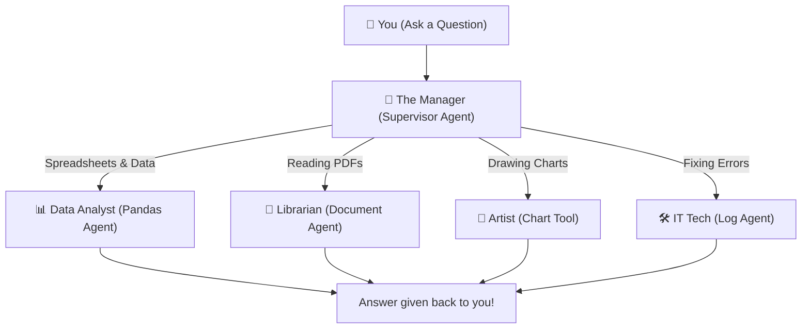

# 🎓 Student Data AI Agent

> **An intelligent multi-modal conversational AI agent. Analyze tabular datasets, query documents, generate charts, and debug log files — all by just asking questions in plain English!**

[](https://www.python.org/)
[](https://langchain-ai.github.io/langgraph/)
[-orange.svg)](https://mistral.ai/)
[](https://streamlit.io/)

---

## 🌟 Overview

The **Student Data AI Agent** is a powerful system that lets you interact with diverse types of files (CSV, Excel, Parquet, PDF, TXT, and LOG) using natural language. 

Instead of writing code or complex queries, you can just ask questions like *"What is the average GPA of students in Computer Science?"* or *"Can you create a bar chart of attendance?"*

---

## ✨ Key Features

- 💬 **Natural Language Data Querying**: Ask complex analytical questions over structured datasets.
- 📄 **Document QA**: Ask questions and get answers from your uploaded PDFs and text documents.
- 🐞 **Log Debugging**: Upload application `.log` files. The agent will read them, find what caused a crash, and tell you how to fix it in simple terms.
- 📊 **Dynamic Chart Generation**: Generate beautiful data visualizations instantly.
- 🧠 **Smart Memory**: The agent remembers your previous questions in the chat, allowing you to ask follow-up questions seamlessly.
- 🖥️ **Interactive Web UI**: A simple, user-friendly interface where you can drag-and-drop files and chat.

---

## 🧠 How It Works (Simple Explanation)

Think of this system as a highly organized office with a **Manager** and several **Specialist Employees**:

1. **You ask a question**: You type a request into the chat (e.g., *"Make a chart of student grades"*).
2. **The Manager decides**: The "Supervisor" agent reads your question and figures out who is best suited to answer it.
3. **The Specialists do the work**:
   - 📊 **The Data Analyst**: Handles spreadsheets (CSV/Excel) and calculates numbers.
   - 📖 **The Librarian**: Reads through PDFs and text files to find quotes and answers.
   - 🎨 **The Artist**: Draws charts and graphs based on your data.
   - 🛠️ **The IT Technician**: Reads computer `.log` files to figure out why an app crashed.
4. **You get your answer**: The specialist finishes their task, hands it back to the Manager, and the Manager replies to you in the chat!

### Architecture Flowchart


---

## 💻 How to Run the App

All you need to do to start the application is run this simple command in your terminal:

```bash
streamlit run app.py
```

Open your browser to `http://localhost:8501`. 

**How to Use:**
1. Upload your files from the sidebar (`.csv`, `.xlsx`, `.pdf`, `.txt`, `.log`).
2. Ask questions in the chat!

---

## 💡 Example Things You Can Ask

| Feature | Example Question |
| :--- | :--- |
| **📊 Tabular Data** | *"How many total students are in the dataset?"*<br/>*"What is the average GPA of Female students in Computer Science?"* |
| **📈 Visualizations** | *"Plot a bar chart showing the number of students per branch. Make it blue."*<br/>*"Create a scatter plot of Attendance vs Score."* |
| **📄 Documents (PDF/TXT)** | *"According to the uploaded syllabus PDF, what are the grading criteria?"* |
| **🐞 Log Analysis** | *"Analyze the uploaded server.log. Why did the server crash and how do I fix it?"* |

---

## 📄 License

This project is licensed under the **MIT License** - see the [LICENSE](LICENSE) file for details.
